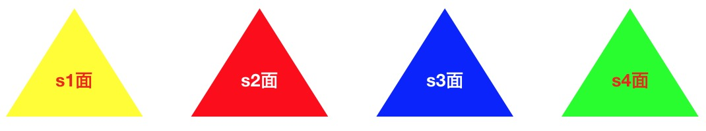

## 1. 效果展示

<CSS3-c04/>

## 2. 绘制

* [完整代码](https://github.com/xiuhonglee/canvasDoc/blob/master/docs/example/CSS3/ch05.html)

正四面体由四个正三角形（[正三角形绘制](/CSS3/c03.html#_2-正三角形)）通过在三维空间内平移旋转得到。实例中通过改变`rotateX`、`rotateY`、`rotateZ`的值可以观察各个面之间的位置。 

:::tip
观察可发现，物体旋转的方向和坐标箭头的关系可以类比“左手定则”。**“左手展平，四指并拢，拇指与四指呈90度夹角”**。以X轴为例，左手握住X轴，拇指指向X轴方向，当`rotateX`增大时，物体顺着四指的方向旋转。反之，当`rotateX`减小，物体旋转方向与四指方向相反。
:::



### 2.1 html结构

```html
<div class="camera">
    <div class="space">
        <div class="box1"></div>
        <div class="box2"></div>
        <div class="box3"></div>
        <div class="box4"></div>
    </div>
</div>
```

### 2.2 绘制s1面

* 首先，通过`translateX(50px) translateY(50px)`将三角形移到`box`中心位置（后面所有三角形都做相同处理，不赘述）。然后，将s1绕X逆向旋转90度。

```css
.box1 {
    border-color: transparent transparent #ff0;
    transform-origin: center bottom;
    transform: translateX(50px) translateY(50px) rotateX(-90deg);
}
```


:::warning
注意上图坐标轴的位置变化。我们旋转的并不是元素本身，而是元素s1所在的坐标系统！
:::

### 2.3 绘制s2面

s1面与s2面夹角约19.5°。直接将s2面围绕X轴反向旋转19.5°即可。


```css
.box2 {
  border-color: transparent transparent #f00;
  transform-origin: center bottom;
  transform: translateX(50px) translateY(50px) rotateX(-19.5deg);
}
```

### 2.4 绘制s3面

绘制s3稍复杂。首先，以s3的左下角为旋转轴心(`transform-origin: left bottom`)，围绕Y轴正向旋转60°；然后，围绕X轴正向旋转19.8°。图示如下：


```css
.box3 {
  border-color: transparent transparent #00f;
  transform-origin: right bottom;
  transform: translateX(50px) translateY(50px) rotateY(60deg) rotateX(19.5deg);
}
```

### 2.5 绘制s4面

绘制s4和s3类似，旋转轴心在右下角(`transform-origin: right bottom`)，围绕Y轴反向旋转60°；然后，围绕X轴正向旋转19.8°。

```css
.box4 {
  border-color: transparent transparent #00f;
  transform-origin: left bottom;
  transform: translateX(50px) translateY(50px) rotateY(-60deg) rotateX(19.5deg);
}
```