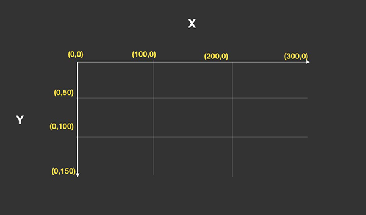

<!--  -->

## 基本概念

`canvas`在未指定宽高的情况下会创建如图所示的坐标系统，默认宽高为300x150像素。坐标系统以左上角为坐标原点，从坐标原点向右为X轴正半轴，从坐标原点向下为Y轴正半轴。

## 坐标系统变换

Canvas的坐标系统并不是固定的，根据实际场景，往往需要对Canvas坐标系统进行相应的变换，具体变换方式如下：
* 平移(translate)
* 旋转(rotate)
* 缩放(scale)

## 使用场景

#### 1. 在canvas中心绘制矩形

<Canvas-ch01-d01/>

- [完整代码](https://github.com/xiuhonglee/canvasDoc/blob/master/docs/.vuepress/components/Canvas-ch01/d01.vue#L26-L36)

``` js{5}
let ctx = this.$refs.canvas.getContext('2d');
ctx.save();

// 将坐标系平移至画布中心
ctx.translate( canvas.width / 2 - width / 2, canvas.height / 2 - height / 2);

ctx.fillRect(0, 0, width, height);
ctx.restore();
```

#### 2. 交互式旋转图形

* 更多场景参考[坐标变换](/Canvas_ch01/d08.md)
